# 1 - Ecran de connexion

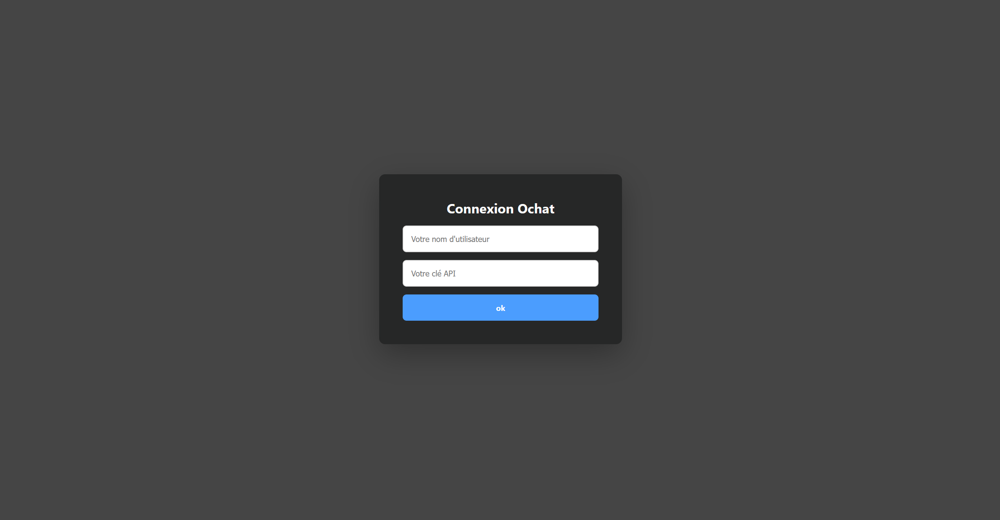

# 2 - Erreur clé API

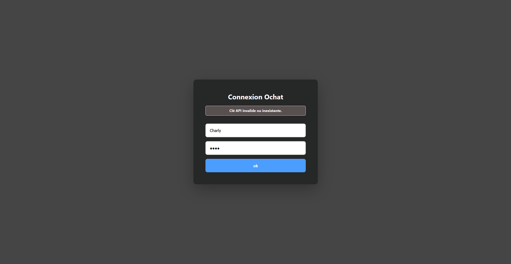

# 3 - Ecran d'accueil

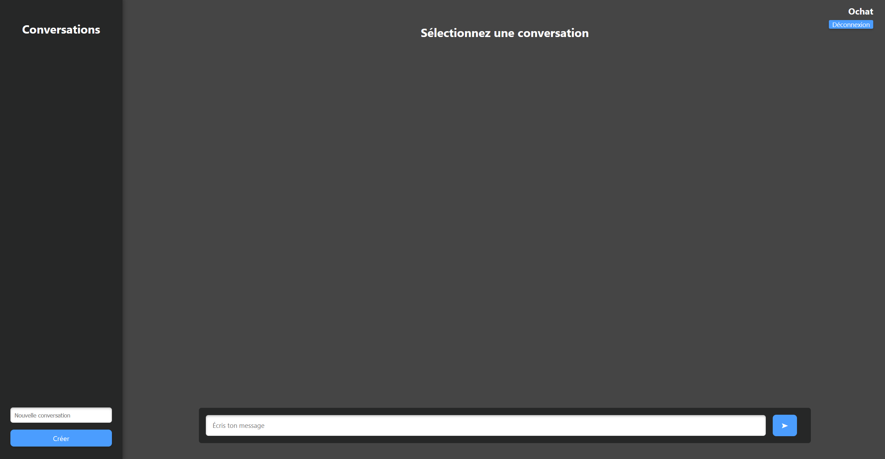

# 4 - Aucune conversation créée

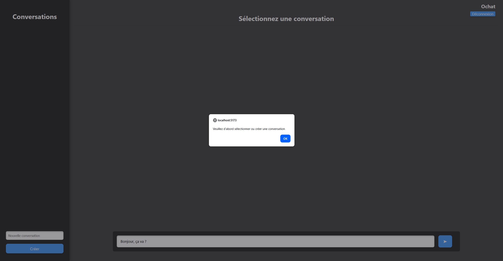

# 5 - Création d'une conversation

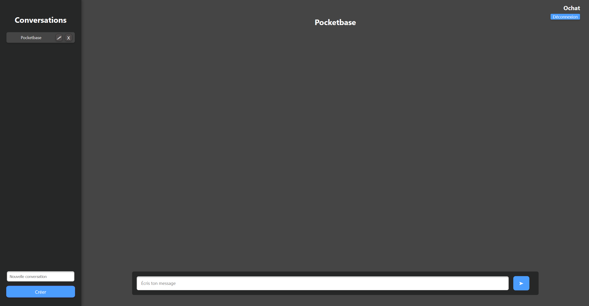

# 6 - Conversation, envoi et réponse API Mistral

# 7 - Stockage conversation dans Pocketbase

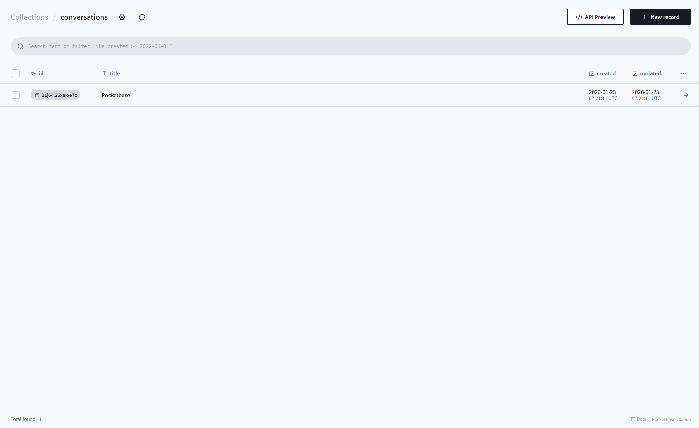

# 8 - Modification de la conversation

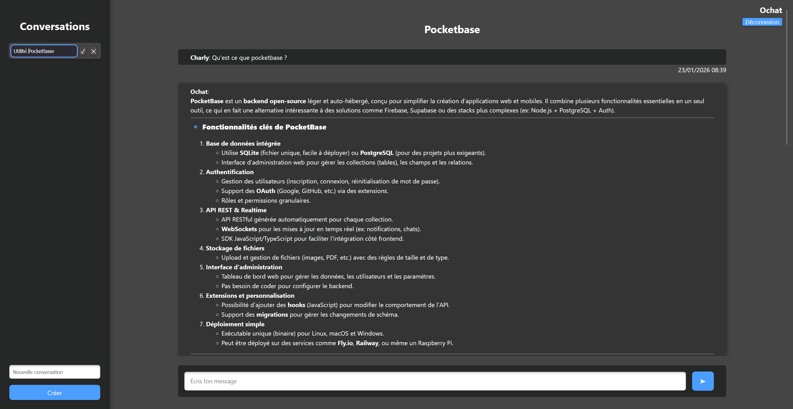

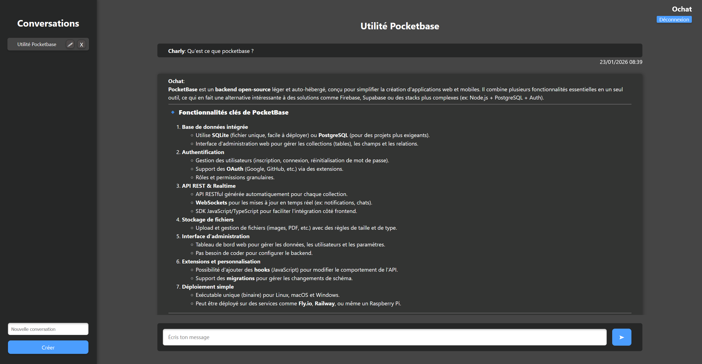

# 9 - Suppression de la conversation

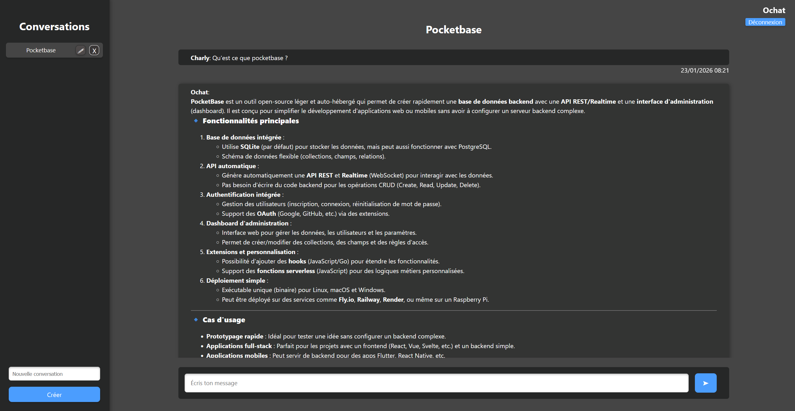

# 10 - Suppression dans pocketbase

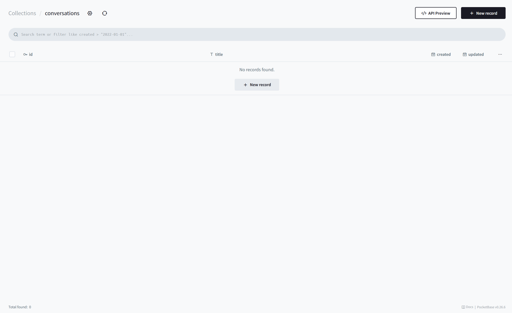

# 11 - Connexion sur mobile

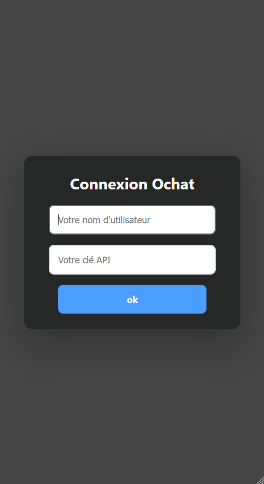

# 12 - Accueil sur mobile

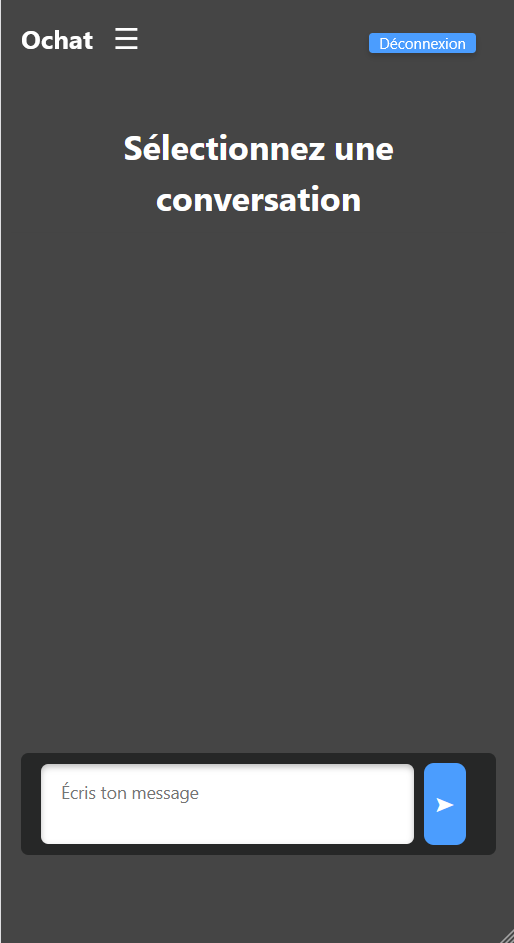

# 13 - Création d'une conversation sur mobile

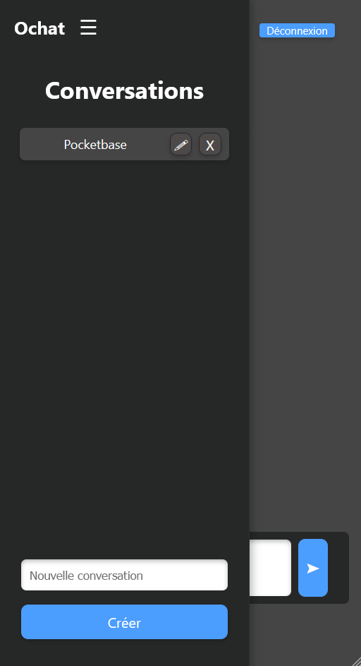

# 14 - Conversation sur mobile

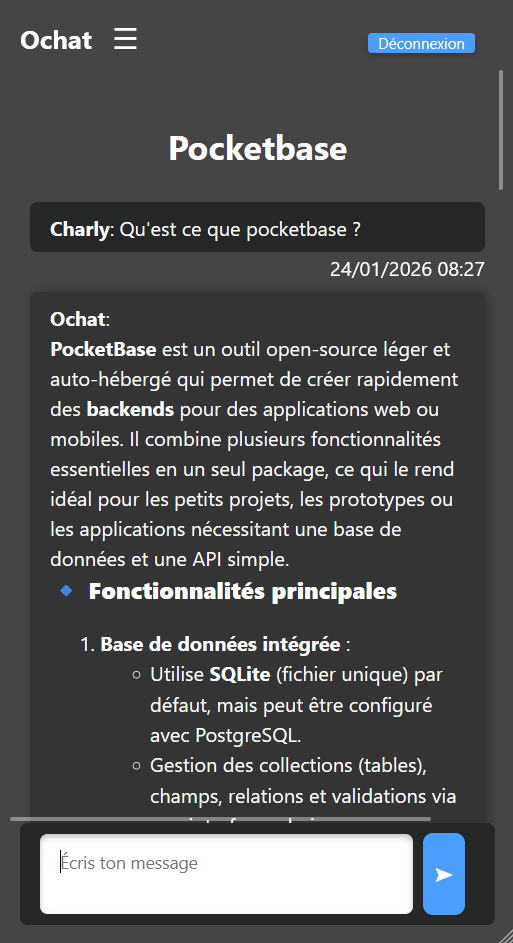
